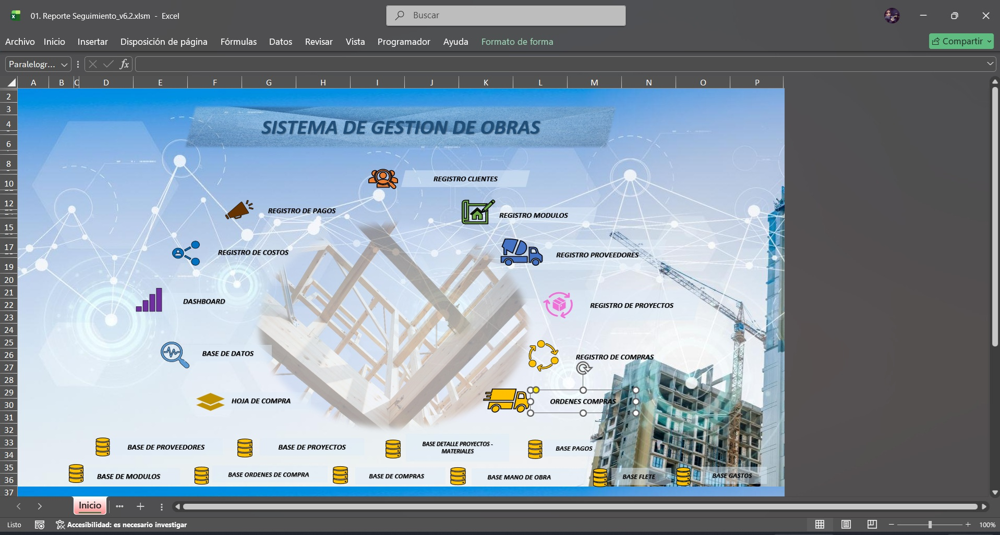
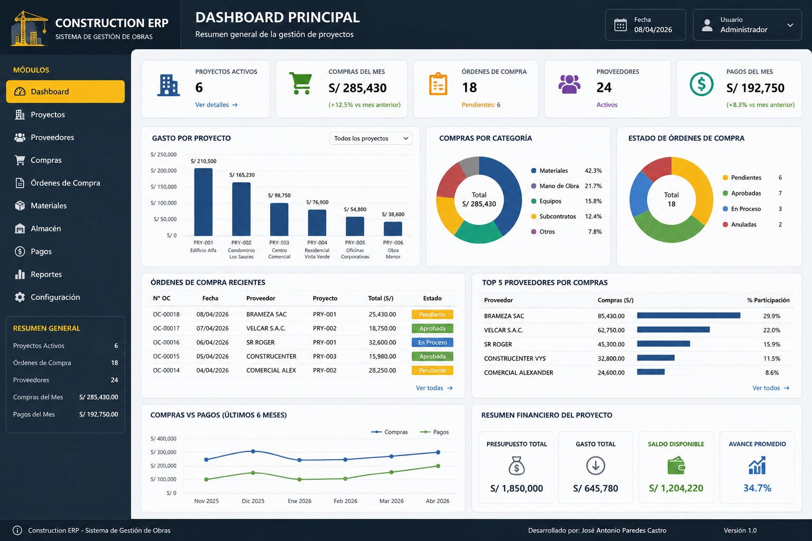

# 🏗️ Construction ERP

## Sistema de Gestión para Proyectos de Construcción

Construction ERP es una solución desarrollada en **Microsoft Excel + VBA** para optimizar la gestión de proyectos, compras, proveedores y órdenes de compra dentro del sector construcción.

El sistema centraliza la información del proyecto, automatiza procesos administrativos y facilita el control operativo mediante formularios, bases de datos y reportes integrados.

---

# 🛠 Tecnologías

- 📈 Microsoft Excel
- ⚙️ VBA
- 🔄 Power Query
- 📊 Tablas Dinámicas
- 📋 Formularios VBA
- 📦 ListView
- 📑 Automatización de procesos

---

# 🚀 Funcionalidades

- 🏗 Gestión de Proyectos
- 📦 Gestión de Materiales
- 🚚 Gestión de Proveedores
- 🛒 Gestión de Compras
- 📄 Generación de Órdenes de Compra
- 📊 Control de Costos
- 📈 Reportes
- 🔄 Automatización mediante VBA

---

# 📷 Capturas

## Pagina Principal

---

## Gestión de Compras

---

## Gestión de Proveedores

---

## Orden de Compra

---

## Módulos del Sistema

---

## Dashboard Principal

---

# 📌 Estado del Proyecto

✅ Proyecto funcional

### Próximas mejoras

- Integración con Base de Datos SQL
- Dashboard en Power BI
- Control de usuarios
- Reportes avanzados
- Migración futura a aplicación web

---

# 👨‍💻 Desarrollado por

**José Antonio Paredes Castro**
